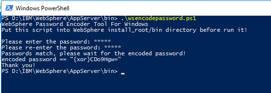
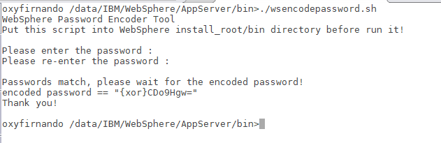

# IBM WebSphere Application Server Password Encryption Tools

This project contain scripts for IBM WebSphere Application Server Password Encryption Tools.

* **wsencodepassword.ps1** for Windows Powershell.
* **wsencodepassword.sh** for Unix/Linux bash script.

**PowerShell**
 

**Unix/Linux Bash Script**
 

## How It Works

Basicaly it run IBM WebSphere Application Server native Java com.ibm.ws.security.utils.PasswordEncoder and com.ibm.ws.security.utils.PasswordDecoder classes.

## Usage
Put the script into IBM WebSphere Application Server **install_root/bin** directory and
1. For Windows Powershell just directly execute the script
2. For Unix/Linux you need to allow execute permission for the script (chmod +x wsencodepassword.sh) and after that just directly execute it. 
